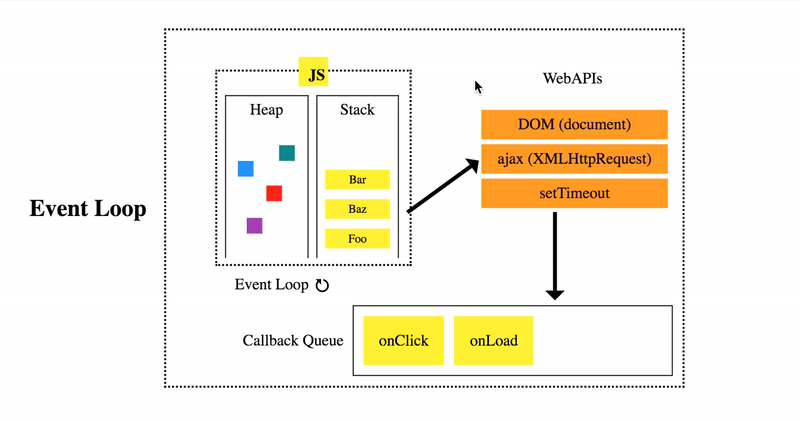

# Лекция 4
## 24.10.20


## Преговор на прототипоното наследяване
```javascript
function Person(name, age) {
  this.name = name;
  this.age = age;
}
Person.prototype.isAdult = function() {
  return this.age > 18;
}

var Ivan = new Person(name, age);

function Employee(name, age, position) {
  Person.call(this, name, age);
  this.position = position;
}

Employee.prototype = Object.create(Person.prototype);
```

## Функционалното програмиране в JS
Много са удобни за трансформации на списъци
* `map` - връща копие на дадения масив като изпълнява описаната операция в/у всеки елемент 
```javascript
  [1,2,3].map(function(curr) {
    return curr + 1;
  }); // [2, 3, 4]
```

* `filter` - * `map` - връща нов масив, чиито елементи са тези елементи на първоначалния, за които подадената функция е върнала истина.
```javascript
  [1,2,3, 4, 5, 6].filter(function(curr) {
    return curr % 2 === 0;
  }); // [2, 4, 6]
```


* `reduce` - изпълнява подадената операция (редуктор) в/у всеки елемент, като резултатът е единична изходна стойност.
```javascript
  function sumAll() {
    return args.reduce(function(acc, curr) {
      return acc + curr;
    }, 0)
  }

  console.log(sumAll(1, 2)); // 3
  console.log(sumAll(1, 2, 3, 4)); // 10
  console.log(sumAll(1)); // 1

  function weirdArrayToObject(arr) {
    return arr.reduce(function(acc, curr) {
      var { key, value } = curr;
      return { ...acc, { key: key, value: value } };
    }, {})
  }
  var arr = [
    { key: 'ivan', value: 'student' },
    { key: 'stancho', value: 'teacher' },
    { key: 'baba', value: 'student' }
  ]
  console.log(weirdArrayToObject(arr)); // { ivan: 'student', stancho: 'teacher', baba: 'student' }
```

# Event Loop и асинхронните операции в JS



Както най-вероятно знаете, JS работи само на една нишка. Това означава, че когато дадено нещо се обработва, няма как да се обработи друго. Тук идва проблемът, ако се извика операция, която отнема много време, тогава нашето приложение ще "забие", т.е. ще стигнем до _deadlock_.

Начинът, по който JS се справя с това е посредством асинхронни операции - операции с отложено изпълнение. В основата на това е *Event Loop*-ът.

*Event Loop*-ът има една проста задача - да следи _Call Stack_-а и _Callback Queue_-то. Когато call stack-ът е празен, той взима първата операция от queue-то и я слага в него (дефакто я изпълнява).
В _callback queue_-ти живеят асинхронните оперции

## накратко за `node` модулите

За да демонстираме асинхронността, ще използваме `fs` модула в `node`.

Как се добавят модули? Това става с помощтта на ключовата дума `require`.
```javascript
var fs = require('fs');
```
Горният код ни дава достъп до `fs`_(File System)_ модула


## back to `async`

```javascript
var fs = require('fs');

var content = fs.readFileSync(
  './text.txt',
  { encoding: 'utf-8' } // ако тук пропуснем encoding-а, данните ще ни се върнат под формата на буфер
);
console.log(content)
```

Горният код ще прочете съдържанието на даденият файл и ще го изпечата в конзолата. Проблемът с него е, че самото четене ще се изпълни _синхронно_, т.е. нашето приложение ще _спре_ докато не приключи четенето на файлта.

Сега ще разгледаме как може да изпълним горното нещо по асинхронен(отложен) начин


```javascript
var fs = require('fs');

fs.readFile(
  './text.txt', { encoding: 'utf-8' },
  // функцията, която ще се изпълни след като операцията приключи
  function cb(err, content) {
    // По конвенция `node` винаги връща грешката като първи аргумент
    if (err) { console.error(err); return; }
    console.log('text.txt');
    console.log(content);
  }
);
console.log('Main file');
console.log('baba');

/*
  Main file
  baba
  text.txt
  <text.txt contents>
*/
```

`setTimeout(fn, time)` - изпъли дадената операция след най-малко `time` милисекунди

Един интересен проблем
```javascript
for (var i = 0; i < 5, i++) {
  setTimeout(function() { console.log(i); }, 0)
}
```
резултатът от горното ще е `5 5 5 5 5`
Ето няколко начина, по които може да оправим проблема:
```javascript
// така ще работи, защото closure-и
for (var i = 0; i < 5, i++) {
  var cbFactory = function(cI) {
    return function() { console.log(cI); }
  }
  setTimeout(cbFactory(i), 0)
}
```
```javascript
// така ще работи, защото изменяме аргументите на функцията посредством bind
for (let i = 0; i < 5, i++) {
  setTimeout(
    function(currentI) { console.log(currentI); }.bind(null, i),
    0
  );
}
```
```javascript
// the same, but different
for (let i = 0; i < 5, i++) {
  setTimeout(
    function() { console.log(this.i); }.bind({ i: i }),
    0
  );
}
```
Още няколко интересни решения:
```javascript
// така ще работи, защото на setTimeout, може да подадем и аргументите, с които да се извика callback-a
for (let i = 0; i < 5, i++) {
  setTimeout(function(currI) { console.log(currI); }, 0, i);
}
```
```javascript
// така ще работи, защото `let` използва block scoping
for (let i = 0; i < 5, i++) {
  setTimeout(function() { console.log(i); }, 0)
}
```

## Приоритизация на асинхронните операциии?

`setImmediate()` - изпълни ми подаденото нещо, но с малко по-висок приоритет. Това не е част от конвенцията и работи по различни начини на различните места. Handle with care

```javascript
setImmediate(function() {
  console.log('immediate');
});
setTimeout(function() {
  console.log('timeout')
});
console.log('main');
```

## `micro` vs `macro`

`process.nextTick` - друг начин за отложено изпъление не кода ни
Разликата м/у `process.nextTick(fn)` и `setTimeout(fn, 0)` е, че `nextTick` ще се изпълни веднага след като събията в Event Queue-то са изпълнени за една итерация, извъртане, т.е. изпълни се веднага със следващото завъртане на event loop-а

```javascript
process.nextTick(function () {
  console.log('tick');
});
```
