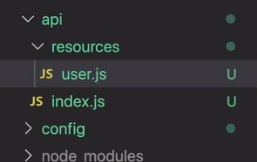

# Лекция 8
## 21.11.20

* Handling Node **environment variables**
  * they externalize all environment specific aspects of your app and keep your app encapsulated
  * accessible from `process.env`

* Serving **static files** in Express
  * use the built-in middleware
      ```javascript
      express.static('static', [options]);
      ```
  * read about the different options [here](http://expressjs.com/en/resources/middleware/serve-static.html)
  * to use with multiple static folders we need to attach the middleware multiple times
      ```javascript
      app.use(express.static('public'));
      app.use(express.static('files'));
      ```
  * the path that you provide to the function is relative to the directory from where you the process is launched, thus it’s safer to use the absolute path
      ```javascript
      app.use(express.static(path.join(__basedir, 'static')));
      ```
* REST API
  * defined by Roy Fielding in his 2000 PhD dissertation _"Architectural Styles and the Design of Network-based Software Architectures"_
  * code/logic/concern separation with **Express Routers**
      ```javascript
      const { Router } = require('express');

      const router = Router();

      router.get('/', function(req, res) { /* ... */ });    // handle /user
      router.get('/:id', function(req, res) { /* ... */ }); // handle /user/:id
      // ...

      app.use('user', router);
      ```
    This allows us to separate our code in multiple _resource modules_
    
  * [Postman](https://www.postman.com/) - a useful tool for building and testing our APIs
  * **query param** handling in Express
    * a query param is the part of the URL after the question mark (?),  meant to send small amounts of information to the server via the url
    * accessible via `req.query`:
        ```javascript
        router.get('/user', async function(req, res) {
            const { page, limit } = req.query; // http://localhost:4200/user?page=1&limit=5
            // page === '1', limit === '5'  
            // ...
        });
        ```
  * **route param** handling in Express
    * route params are the way to store information in the _actual URL_. We can use these to structure web pages by information/data.
    * accessible via `req.params`:
        ```javascript
        router.get('/user/:id', async function(req, res) {
            const { id } = req.params; // http://localhost:4200/user/123
            // id === '123'
            // ...
        });
        ```
  * Some cool guides
    * [Microsoft REST API guidelines](https://github.com/microsoft/api-guidelines)
    * [Google Style Guide](https://google.github.io/styleguide/jsguide.html)

  * Storing data
    * For this lecture we'll be using **MongoDB**
        * NoSQL DB
        * "MongoDB is a general purpose, document-based, distributed database built for modern application developers and for the cloud era."
    * [Installation guide](https://docs.mongodb.com/manual/installation/)
    * We'll be using [`npm mongodb`](https://www.npmjs.com/package/mongodb) in our project
      * this is official **MongoDB** driver for **Node**
          ```javascript
          const config = require('./config')
          const MongoClient = require('mongodb').MongoClient;

          MongoClient.connect(config.db.url, function(err, client) {
            if (err) { console.error(err); return; }
            console.log("Connected successfully to DB");
            const db = client.db(dbName);

            // ...
          
            client.close();
          });
          // ...
          ```
      * In the lecture code we'll be using the *promisified version* of the above.